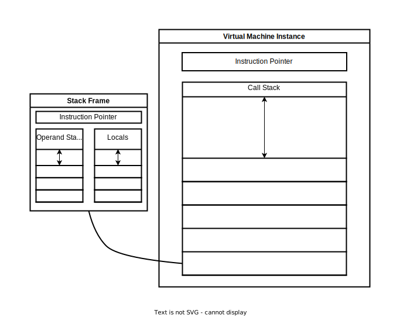

# bytecode (LightVM)

 

## Virtual Machine Architecture
___

___

 

## Instructions
___
|          **Bytecode**         |       **Rust instruction**       |                                                                        **Description**                                                                       |
|:-----------------------------:|:--------------------------------:|:------------------------------------------------------------------------------------------------------------------------------------------------------------:|
| **LOAD_VAL {val}**            | **LoadValue(isize)**             | Pushes value to the operand stack of the actual frame.                                                                                                       |
| **WRITE_VAR {var}**           | **WriteVariable(usize)**         | Pushes local variable to the locals stack of the actual frame.                                                                                               |
| **READ_VAR {var}**            | **ReadVariable(usize)**          | Gets local variable from locals stack of the actual frame.                                                                                                   |
| **ADD**                       | **Add**                          | Pops two values from the operand stack of the actual frame, adds them and pushes back to the stack.                                                          |
| **SUB**                       | **Sub**                          | Pops two values from the operand stack of the actual frame, subs them and pushes back to the stack.                                                          |
| **MULTIPLY**                  | **Multiply**                     | Pops two values from the operand stack of the actual frame, multiplies them and pushes back to the stack.                                                    |
| **DIVIDE**                    | **Divide**                       | Pops two values from the operand stack of the actual frame, divides them and pushes back to the stack.                                                       |
| **PRINT**                     | **Print**                        | Prints last value in the operand stack of the actual frame.                                                                                                  |
| **PRINT {var}**               | **PrintVariable(String, usize)** | Prints value of chosen local variable in the locals stack of the actual frame.                                                                               |
| **FUNC {func_name}**          | **Jump(usize)**                  | Sets instruction pointer.                                                                                                                                    |
| **JUMP_IF_EQ {label_name}**   | **JumpIfEqual(usize)**           | Pops two values from the operand stack of the actual frame and jumps to chosen pointer if values are equal.                                                  |
| **JUMP_IF_NQ {label_name}**   | **JumpIfNotEqual(usize)**        | Pops two values from the operand stack of the actual frame and jumps to chosen pointer if values aren't equal.                                               |
| **JUMP_IF_GR {label_name}**   | **JumpIfGreater(usize)**         | Pops two values from the operand stack of the actual frame and jumps to chosen pointer if left value is greater than right value.                            |
| **JUMP_IF_SM {label_name}**   | **JumpIfSmaller(usize)**         | Pops two values from the operand stack of the actual frame and jumps to chosen pointer if left value is smaller than right value.                            |
| **JUMP_IF_GREQ {label_name}** | **JumpIfGreaterEqual(usize)**    | Pops two values from the operand stack of the actual frame and jumps to chosen pointer if left value is greater or equal to right value.                     |
| **JUMP_IF_SMEQ {label_name}** | **JumpIfSmallerEqual(usize)**    | Pops two values from the operand stack of the actual frame and jumps to chosen pointer if left value is smaller or equal to right value.                     |
| **RETURN**                    | **Return**                       | Jumps from function end to call instruction.                                                                                                                 |
| **RETURN_VAL**                | **ReturnValue**                  | Pops value from the function frame's operand stack, jumps from function end to call instruction and pushes popped value to the operand stack of upper frame. |
| **LABEL {label_name}**        | **Ignore**                       | Does nothing.                                                                                                                                                |
___
